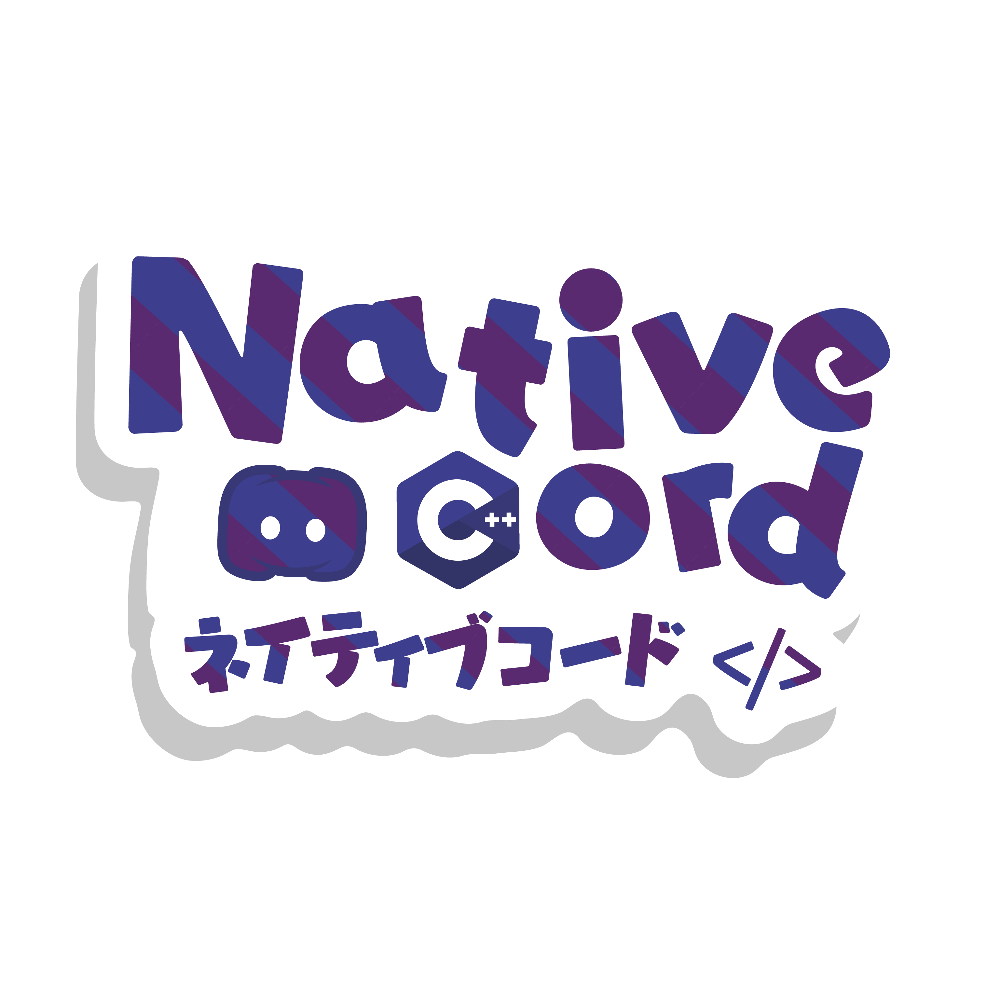

<h1 align="center">
	<br/>
    <b>nativecord (lib)</b>
</h1>
<p align="center">
	A minimalist cross-platform C++ library designed to facilitate interaction with Discord.
	<br/>
	Made with bots, applications and clients in mind.
	<br/> <br/>
	<a href="https://discord.gg/uEvGbYZT9xt"><b>Join our server</b></a>
</p>

> [!WARNING]  
> This project is currently in its **early development stage**. As such, breaking changes may occur frequently without prior notice. We are actively working on improving and refining the library, so please be prepared to adapt your code accordingly. \
> \
> Your feedback and contributions are highly appreciated as we work towards stabilizing the project. Thank you for your understanding and patience.

## Features
- Simplified interface for interacting with Discord's API and gateway
- Cross-platform compatibility
- Minimalist design for easy integration into existing projects.

## Associated projects
* [client](https://github.com/nativecord/client "client") - A Discord client powered by this library.
* [imcord](https://github.com/nativecord/imcord "imcord") - An example UI implementation used by the client.

## Requirements
* CMake 3.29.2
* OpenSSL

## Example usage
```C++
#include <nativecord/client.h>

void yourFunction() {
	/*
		instantiate client, configure and register connection
	*/
	nativecord::Client client;
	client.setToken(yourToken);
	client.setIntents(INTENT_GUILDS | INTENT_GUILD_MESSAGES | INTENT_GUILD_MEMBERS);
	client.connect();
	
	client.on("ready", [](nativecord::Client* client) {
		Log::Info("Client is ready");
 		Log::Info("Logged in as {} | {}", client->getUser()->username, client->getUser()->id);
		client->setPersona(STATUS_IDLE);
	});

	/*
		this will yield the current thread untill all clients are disconnected
	*/
	nativecord::websockets::pollEvents();
}
```

## Contributing
We welcome contributions to nativecord. If you'd like to contribute, please follow these guidelines:
1. ***Conventional commits*** - Follow the [conventional commits](https://www.conventionalcommits.org/en/v1.0.0/).  specification for commit messages. This helps automate versioning and generate meaningful changelogs.
2. ***Branch Naming Convention*** - Use descriptive branch names that reflect the purpose of your changes. Preferably, use kebab-case or snake_case for branch names.
3. ***Code Style and Formatting*** - Follow the project's existing code style and formatting guidelines. Ensure .clang-format has formatted your code before commiting.
4. ***Committing Changes*** - Avoid committing unrelated changes in the same commit, Keep each commit focused on a single logical change and Squash related commits before opening a pull request to keep the commit history clean and concise.
5. ***Pull Requests*** - Please provide a clear and detailed description of the changes introduced by the pull request.

By following these guidelines, you can contribute effectively to the nativecord project while maintaining code quality and consistency across the codebase. If you have any questions or need clarification on any of the guidelines, feel free to ask on our [Discord server](https://discord.gg/uEvGbYZT9x).


## Disclaimer
nativecord is an independent project and is not affiliated with or endorsed by Discord Inc. All Discord-related trademarks and logos are the property of their respective owners. The use of Discord's name, logo, or API in this project does not imply endorsement or sponsorship by Discord Inc.

nativecord is provided "as is," without warranty of any kind, express or implied. In no event shall the authors or copyright holders be liable for any claim, damages, or other liability, whether in an action of contract, tort, or otherwise, arising from, out of, or in connection with the software or the use or other dealings in the software.

